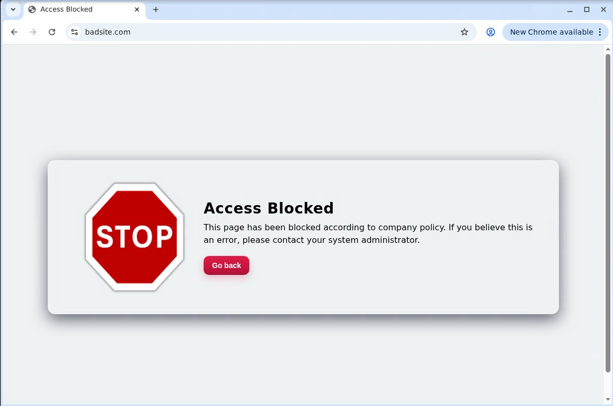
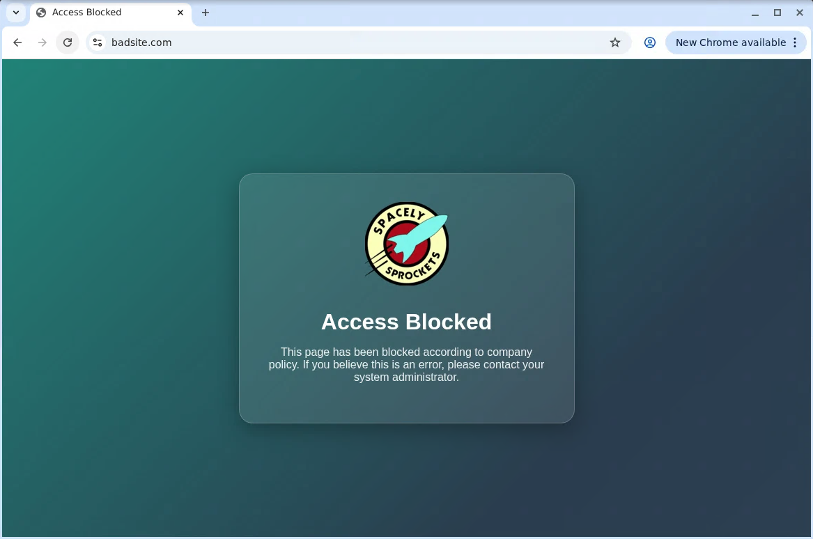

# SSL Orchestrator Advanced Blocking Pages
Advanced Blocking Pages is an F5 SSL Orchestrator **service extension** function for managing a dynamic blocking pages. The service can either be deployed as a static blocking page at the end of a blocking traffic policy, or can apply iRule logic to dynamically inject blocking page content.

Requires:
* BIG-IP SSL Orchestrator 17.1.x (SSLO 11.1+)

### To implement via installer:
1. Run the following from the BIG-IP shell to get the installer:
  ```bash
  curl -sk https://raw.githubusercontent.com/f5devcentral/sslo-service-extensions/refs/heads/main/advanced-blocking-pages/advanced-blocking-pages-installer.sh -o advanced-blocking-pages-installer.sh
  chmod +x advanced-blocking-pages-installer.sh
  ```

2. Export the BIG-IP user:pass:
  ```bash
  export BIGUSER='admin:password'
  ```

3. Run the script to create all of the SaaS Tenant Isolation objects
  ```bash
  ./advanced-blocking-pages-installer.sh
  ```

4. The installer creates a new inspection service named "ssloS_F5_Advanced-Blocking-Pages". Add this inspection service to any service chain that can receive decrypted HTTP traffic. Service extension services will only trigger on decrypted HTTP, so can be inserted into service chains that may also see TLS bypass traffic (not decrypted). SSL Orchestrator will simply bypass this service for anything that is not decrypted HTTP.

------
### To customize functionality
The **advanced-blocking-pages-rule** has a set of editable configuration blocks:
* **GLOBAL_BLOCK**: <br />Enables or disables a static blocking response.
  * When set to 1 (on), the blocking page service should be added to the end of a blocking service chain.
  * When set to 0 (off), the blocking page will be controlled by iRule logic. While global blocking is appropriate for most scenarios, this iRule option can address special use cases like blocking based on server side certificate validation errors (more on this below).
* **GLOBAL_BLOCK_MESSAGE**: <br />When the blocking page (iFile) content includes a placeholder value (more on this below), this string message will be dynamically inserted into the page returned to the browser.
 
------
### To customize the blocking page content
The blocking page iFile is completely customizable based on your local needs. In the BIG-IP, under System -> File Management -> iFile List, choose a new HTML file, select Overwrite Existing, and select the **se-blocking-page** iFile to replace it. To inject a dynamic message in the page, ensure a **$receive_msg** variable is included. This is implemented in the blocking pages iRule by setting a string value on **receive_msg** variable before calling the GEN_BLOCK_PAGE procedure.

------
### To handle server side certificate errors
Handling server side certificate issues requires a few additional steps:
1. In the SSL Orchestrator UI, edit the topology, go to the **SSL Configuration** page, click the "Show Advanced Setting** link, and then set **Expire Certificate Response** and **Untrusted Certificate Authority** to "mask". The mask option tells SSL Orchestrator to ignore server side certificate issues and forge a good/valid certificate to the client. This is needed in order to present a blocking page. Deploy the changes.
2. In the SSL Orchestrator UI, navigate to the Interception Rules tab and click to edit the interception rule for this topology. In the **Resources** section, add the **sslo-tlsverify** iRule. Click Save & Next and then deploy the changes. This iRule sits on the topology virtual at SERVERSSL_SERVERCERT and sends the certificate verification code into a context array variable. The blocking page iRule (when GLOBAL_BLOCK is 0) will read this context array variable and trigger the blocking page if the certificate verification code is not 'ok'. It also injects the verification code string into the page.

------
### Sample blocking pages




